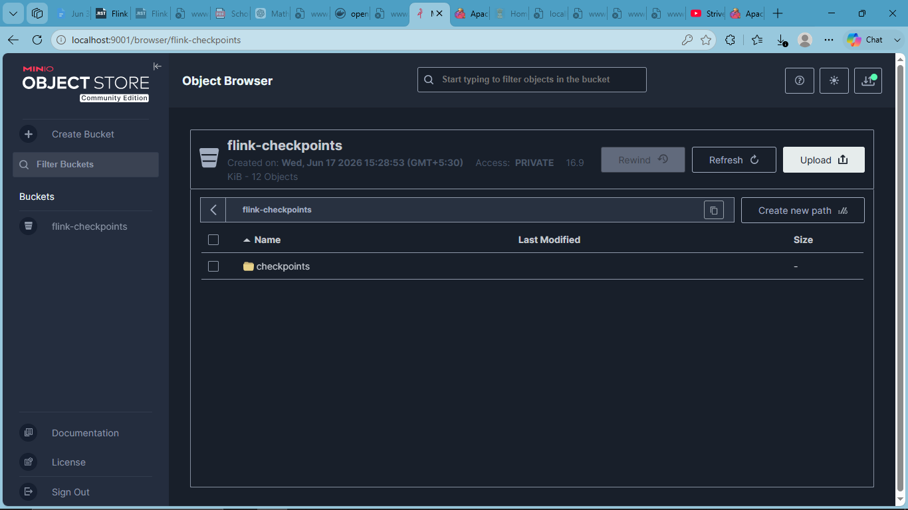
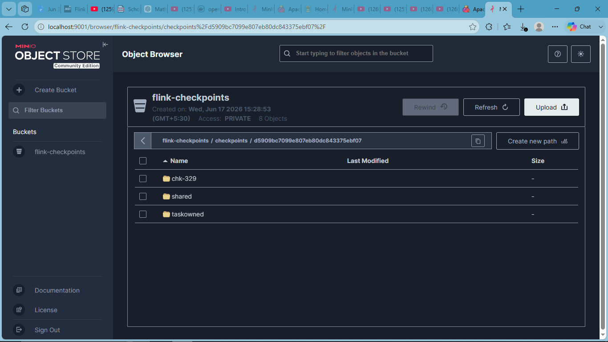
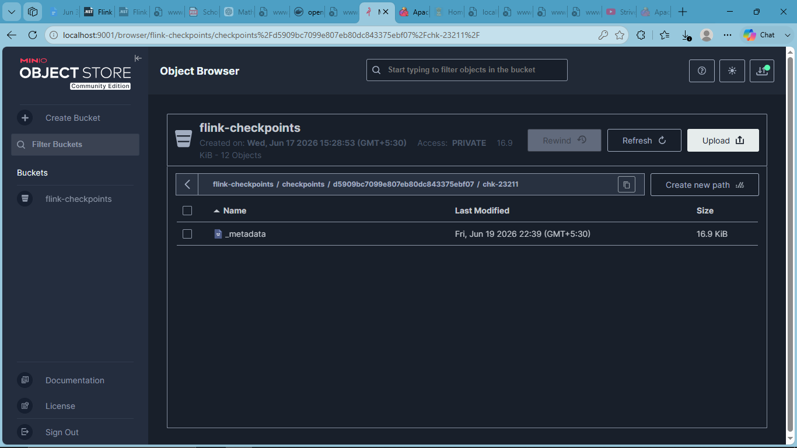

Flink Checkpointing with OpenLake
=================================
.. contents:: On this page
   :depth: 2

Introduction
------------

This document explains how Apache Flink can be used with OpenLake
for checkpointing and state management.

Prerequisites
-------------

- Docker Desktop installed and running
- Apache Flink Docker image (``flink:latest``)
- OpenLake / MinIO Docker image (``minio/minio``)
- PowerShell (Windows) or Bash (Linux/Mac)

.. note::
   This guide currently uses the official ``minio/minio`` image as a
   stand-in for OpenLake's object storage layer, since OpenLake's
   storage API is S3-compatible. If a dedicated OpenLake Docker image
   becomes available, the same steps apply by swapping the image name.

OpenLake Setup
--------------

Overview of setting up an OpenLake (MinIO-backed) cluster — see
"Creating an OpenLake Cluster" below for full commands and output.

Flink Environment Setup
-----------------------

Overview of setting up Flink JobManager and TaskManager — see
"Running a Flink Job" below for full commands and output.

Checkpointing Workflow
----------------------

Flink periodically saves the state of a running job (a "checkpoint")
to a configured storage location. By pointing Flink's S3 filesystem
connector at OpenLake's endpoint, these checkpoints are written
directly into an OpenLake bucket instead of local disk.

Creating an OpenLake Cluster
----------------------------

To spin up an OpenLake (MinIO) cluster using Docker, run the following command:

.. code-block:: bash

   docker run -d --name openlake `
     -p 9000:9000 -p 9001:9001 `
     -e MINIO_ROOT_USER=admin `
     -e MINIO_ROOT_PASSWORD=password `
     minio/minio server /data --console-address ":9001"

**Output:**

.. code-block:: text

   Unable to find image 'minio/minio:latest' locally
   latest: Pulling from minio/minio
   Status: Downloaded newer image for minio/minio:latest
   7cc06d6022c46fc00967e39ded70d370c287aec419fd77f994ea14faf2bdce2

Once running, open your browser and go to ``http://localhost:9001``.
Login with username ``admin`` and password ``password``.

Create a bucket named ``flink-checkpoints`` from the web console
(used in the next steps as the checkpoint destination).

Running a Flink Job
-------------------

To spin up a Flink JobManager connected to OpenLake:

.. code-block:: bash

   docker run -d --name flink-jobmanager `
     -p 8081:8081 `
     --link openlake:openlake `
     -e FLINK_PROPERTIES="jobmanager.rpc.address: flink-jobmanager" `
     flink:latest jobmanager

**Output:**

.. code-block:: text

   Unable to find image 'flink:latest' locally
   latest: Pulling from library/flink
   Status: Downloaded newer image for flink:latest
   cfe1fbfb1305ea33a6993a958073b6877e874e3d2cfe15ca75199df7b1b08dc4

Then spin up a TaskManager (required to actually execute job tasks
— a JobManager alone has no task slots):

.. code-block:: bash

   docker run -d --name flink-taskmanager `
     --link flink-jobmanager:flink-jobmanager `
     --link openlake:openlake `
     -e FLINK_PROPERTIES="jobmanager.rpc.address: flink-jobmanager" `
     flink:latest taskmanager

**Output:**

.. code-block:: text

   a29e01243c8f64225f855e3b2c77ab2e59ac909ac5f1f61d775a8e095a46ccce

Access the Flink Dashboard at ``http://localhost:8081``.

.. image:: ../../assets/flink-dashboard.png
   :alt: Flink Dashboard

Input and Output Examples
--------------------------

To configure Flink to write checkpoints to OpenLake, the following
keys are added to Flink's ``config.yaml`` inside the JobManager and
TaskManager containers:

.. code-block:: yaml

   s3.endpoint: http://openlake:9000
   s3.access-key: admin
   s3.secret-key: password
   s3.path.style.access: true

**Verifying the configuration (input):**

.. code-block:: bash

   docker exec flink-jobmanager cat /opt/flink/conf/config.yaml

**Output:**

.. code-block:: text

   jobmanager.rpc.address: flink-jobmanager
   jobmanager.rpc.port: 6123
   taskmanager.numberOfTaskSlots: 1
   parallelism.default: 1
   rest.address: 0.0.0.0
   s3.endpoint: http://openlake:9000
   s3.access-key: admin
   s3.secret-key: password
   s3.path.style.access: true

Flink does not bundle the S3 filesystem connector by default, so the
plugin jar must be copied into the plugins directory on **both** the
JobManager and TaskManager:

.. code-block:: bash

   docker exec flink-jobmanager mkdir -p /opt/flink/plugins/s3-fs-hadoop
   docker exec flink-jobmanager cp /opt/flink/opt/flink-s3-fs-hadoop-2.2.1.jar /opt/flink/plugins/s3-fs-hadoop/
   docker exec flink-taskmanager mkdir -p /opt/flink/plugins/s3-fs-hadoop
   docker exec flink-taskmanager cp /opt/flink/opt/flink-s3-fs-hadoop-2.2.1.jar /opt/flink/plugins/s3-fs-hadoop/

Submitting a job with checkpointing enabled (input):

.. code-block:: bash

   docker exec flink-jobmanager flink run -d /opt/flink/examples/streaming/StateMachineExample.jar `
     --backend hashmap `
     --checkpoint-dir s3://flink-checkpoints/checkpoints `
     --incremental-checkpoints false

**Output:**

.. code-block:: text

   Using standalone source with error rate 0.000000 and 1000.0 records per second
   Job has been submitted with JobID d5909bc7099e807eb80dc843375ebf07

Checking job status (input):

.. code-block:: bash

   docker exec flink-jobmanager flink list

**Output:**

.. code-block:: text

   ------------------ Running/Restarting Jobs -------------------
   19.06.2026 09:31:33 : d5909bc7099e807eb80dc843375ebf07 : State machine job (RUNNING)
   --------------------------------------------------------------

Screenshots
-----------

**OpenLake bucket showing checkpoint folder:**

**Checkpoint metadata file confirming a successful write:**

The checkpoint folder (``chk-XXX``) updates with a new ``_metadata``
file (roughly 10-11 KB) on every checkpoint cycle, confirming that
Flink is writing checkpoint data directly to OpenLake.

Logs
----

Full container logs captured during this verification are available
in `flink-logs.txt <flink-logs.txt>`_, covering both the JobManager
and TaskManager, including the initial S3 plugin error and the fix.

References
----------

- Apache Flink documentation: https://flink.apache.org/
- Flink S3 filesystem plugin docs: https://nightlies.apache.org/flink/flink-docs-stable/docs/deployment/filesystems/s3/
- MinIO documentation: https://docs.min.io/
