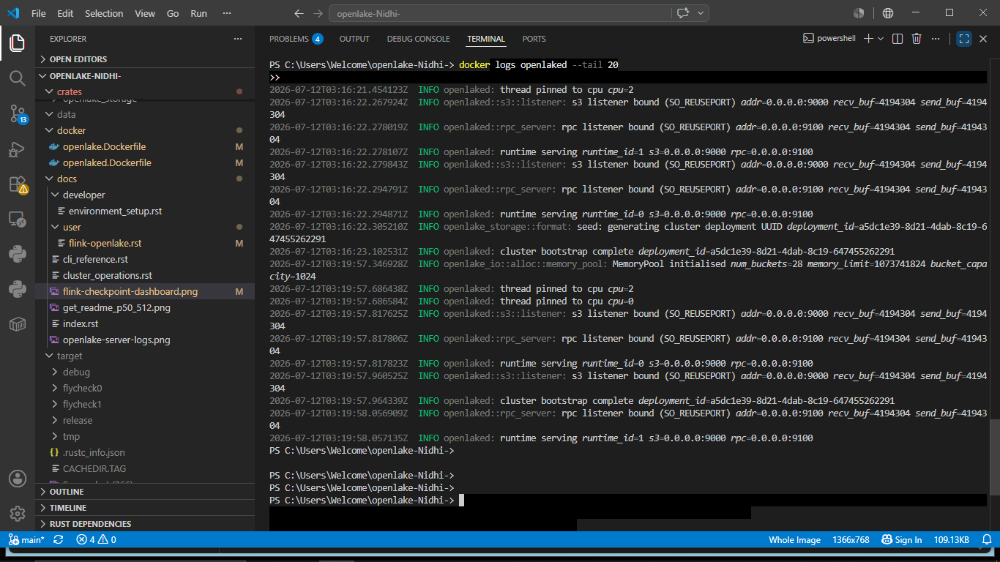
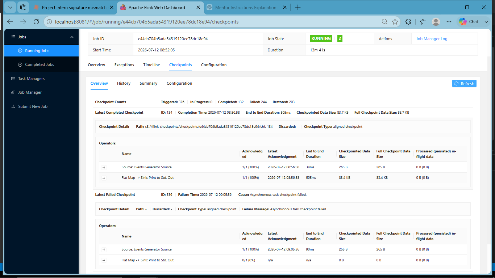

Apache Flink Checkpointing with OpenLake
==========================================
.. contents:: On this page
   :depth: 2

This guide walks through setting up Apache Flink with OpenLake as the
S3-compatible checkpoint storage backend, running an OpenLake cluster
inside Docker, and verifying that Flink checkpoints are successfully
written to and read from OpenLake.

.. note::
   This guide uses the actual ``openlaked`` binary built from this
   repository. The OpenLake server logs (module names such as
   ``openlake_io::``, ``openlake::s3::listener``, and
   ``openlake_storage::format``) confirm this, and are included below for
   reference.

Prerequisites
-------------

- Docker Desktop installed and running
- This repository cloned locally, with the signature-mismatch fix
  (``crates/openlake_server/src/auth.rs``) present on your branch
- ``git`` and a terminal (PowerShell / bash)

Overview of the Setup
----------------------

1. Build the OpenLake server image (``openlaked``) from this repo
2. Configure a single-node OpenLake cluster (``config.toml``)
3. Run the OpenLake container
4. Run a Flink JobManager + TaskManager on the same Docker network
5. Point Flink's checkpoint storage at the OpenLake S3 endpoint
6. Create the checkpoint bucket
7. Submit a Flink job and verify checkpoints complete successfully

Step 1: Create the shared Docker network
------------------------------------------

.. code-block:: bash

   docker network create flink-openlake-net

**Expected output**

.. code-block:: text

   flink-openlake-net

Step 2: Configure OpenLake (``config.toml``)
-----------------------------------------------

Create a ``config.toml`` file at the repository root with the following
content. This configures a single-node, 4-disk cluster with 4+1 erasure
coding:

.. code-block:: toml

   self_id = 1
   data_dirs = ["/var/lib/openlake/data1", "/var/lib/openlake/data2", "/var/lib/openlake/data3", "/var/lib/openlake/data4"]
   s3_addr = "0.0.0.0:9000"
   rpc_addr = "0.0.0.0:9100"
   set_drive_count = 4
   default_parity_count = 1
   region = "us-east-1"
   transport = "h2"

   [[credentials]]
   access_key = "openlakeadmin"
   secret_key = "openlakeadmin"

   [[nodes]]
   id = 1
   rpc_addr = "127.0.0.1:9100"
   disk_count = 4

   [memory_pool]
   enabled = true
   size_bytes = 1073741824
   bucket_capacity = 1024

Step 3: Build the OpenLake server image
------------------------------------------

The Dockerfile at ``docker/openlaked.Dockerfile`` builds the ``openlaked``
binary and bakes the config into the image. Two adjustments were required
on top of the base Dockerfile:

- Added ``libhwloc-dev`` and ``pkg-config`` to the builder's ``apt-get
  install`` step (required for the RocksDB / hwloc native dependency)
- Added the ``data1``–``data4`` subdirectories to the runtime image's
  ``mkdir -p`` step, and copied ``config.toml`` into
  ``/etc/openlake/openlake.toml`` using ``COPY --chown`` (needed because a
  plain ``RUN chown`` fails with ``Operation not permitted`` under Docker
  Desktop on Windows)

.. code-block:: bash

   docker build -t openlaked:latest -f docker/openlaked.Dockerfile .

**Expected output**

.. code-block:: text

   [+] Building 1347.5s (22/22) FINISHED
   ...
   => naming to docker.io/library/openlaked:latest

Step 4: Run the OpenLake container
--------------------------------------

.. code-block:: bash

   docker run -d --privileged --name openlaked \
     --network flink-openlake-net \
     -p 9000:9000 -p 9100:9100 \
     openlaked:latest

.. note::
   ``--privileged`` is required — without it the server panics on startup
   with ``PermissionDenied: Operation not permitted`` while creating its
   async runtime.

**Verify it started correctly**

.. code-block:: bash

   docker logs openlaked --tail 20

**Actual output**

.. code-block:: text

   INFO openlake_io::alloc::memory_pool: MemoryPool initialised num_buckets=28 memory_limit=1073741824 bucket_capacity=1024
   INFO openlaked: spawning runtimes num_runtimes=2 cpus=[0, 2]
   INFO openlaked: thread pinned to cpu cpu=0
   INFO openlaked: thread pinned to cpu cpu=2
   INFO openlake::s3::listener: s3 listener bound (SO_REUSEPORT) addr=0.0.0.0:9000 recv_buf=4194304 send_buf=4194304
   INFO openlake::rpc_server: rpc listener bound (SO_REUSEPORT) addr=0.0.0.0:9100 recv_buf=4194304 send_buf=4194304
   INFO openlaked: runtime serving runtime_id=0 s3=0.0.0.0:9000 rpc=0.0.0.0:9100
   INFO openlaked: runtime serving runtime_id=1 s3=0.0.0.0:9000 rpc=0.0.0.0:9100
   INFO openlake_storage::format: seed: generating cluster deployment UUID deployment_id=3ce94150-ead9-4c95-869a-f2b769c6b24d
   INFO openlaked: cluster bootstrap complete deployment_id=3ce94150-ead9-4c95-869a-f2b769c6b24d

Step 5: Run Flink JobManager and TaskManager
------------------------------------------------

.. code-block:: bash

   docker run -d --name flink-jobmanager \
     --network flink-openlake-net -p 8081:8081 \
     -e FLINK_PROPERTIES="jobmanager.rpc.address: flink-jobmanager" \
     flink:1.18.1-scala_2.12 jobmanager

   docker run -d --name flink-taskmanager \
     --network flink-openlake-net \
     -e FLINK_PROPERTIES="jobmanager.rpc.address: flink-jobmanager" \
     flink:1.18.1-scala_2.12 taskmanager

.. note::
   Use the exact tag ``1.18.1-scala_2.12`` (not the floating ``1.18``
   tag). The floating tag pulled a build that threw
   ``java.lang.NoClassDefFoundError:
   scala.collection.convert.Wrappers$MutableSetWrapper`` on startup.

**Verify both are running**

.. code-block:: bash

   docker ps -a

**Expected output**

.. code-block:: text

   NAMES                STATUS
   flink-taskmanager    Up ...
   flink-jobmanager     Up ...
   openlaked            Up ...

Step 6: Configure Flink to checkpoint to OpenLake
------------------------------------------------------

Append the following to ``/opt/flink/conf/flink-conf.yaml`` inside
**both** the JobManager and TaskManager containers, then restart them:

.. code-block:: bash

   docker exec flink-jobmanager bash -c "cat >> /opt/flink/conf/flink-conf.yaml << 'EOF'
   state.backend: rocksdb
   state.checkpoints.dir: s3://flink-checkpoints/checkpoints/
   s3.access-key: openlakeadmin
   s3.secret-key: openlakeadmin
   s3.endpoint: http://openlaked:9000
   s3.path.style.access: true
   EOF"

   docker exec flink-taskmanager bash -c "cat >> /opt/flink/conf/flink-conf.yaml << 'EOF'
   state.backend: rocksdb
   state.checkpoints.dir: s3://flink-checkpoints/checkpoints/
   s3.access-key: openlakeadmin
   s3.secret-key: openlakeadmin
   s3.endpoint: http://openlaked:9000
   s3.path.style.access: true
   EOF"

Enable the S3 Presto filesystem plugin (required — the bundled Hadoop
S3A implementation is incompatible with OpenLake's AWS SDK v2 signing):

.. code-block:: bash

   docker exec flink-jobmanager mkdir -p /opt/flink/plugins/s3-fs-presto
   docker exec flink-jobmanager cp /opt/flink/opt/flink-s3-fs-presto-1.18.1.jar /opt/flink/plugins/s3-fs-presto/

   docker exec flink-taskmanager mkdir -p /opt/flink/plugins/s3-fs-presto
   docker exec flink-taskmanager cp /opt/flink/opt/flink-s3-fs-presto-1.18.1.jar /opt/flink/plugins/s3-fs-presto/

   docker restart flink-jobmanager flink-taskmanager

Step 7: Create the checkpoint bucket
-----------------------------------------

OpenLake does not create buckets implicitly — create it via the AWS CLI:

.. code-block:: bash

   docker run --rm --network flink-openlake-net \
     -e AWS_ACCESS_KEY_ID=openlakeadmin \
     -e AWS_SECRET_ACCESS_KEY=openlakeadmin \
     -e AWS_REQUEST_CHECKSUM_CALCULATION=when_required \
     amazon/aws-cli --endpoint-url http://openlaked:9000 \
     s3 mb s3://flink-checkpoints

**Expected output**

.. code-block:: text

   make_bucket: flink-checkpoints

.. note::
   ``aws s3 ls`` and ``aws s3api head-bucket`` currently return
   ``NotImplemented`` / ``404`` against OpenLake even after the bucket is
   created successfully — OpenLake's ``ListBuckets`` and ``HeadBucket``
   operations are not yet implemented. This does not affect Flink
   checkpointing, which only needs ``PutObject`` / ``GetObject`` on
   objects inside the bucket, not bucket-level metadata queries.

Step 8: Submit a Flink job and verify checkpoints
--------------------------------------------------------

.. code-block:: bash

   docker exec flink-jobmanager flink run -d \
     /opt/flink/examples/streaming/StateMachineExample.jar

**Expected output**

.. code-block:: text

   Job has been submitted with JobID <job-id>

Check checkpoint status:

.. code-block:: bash

   docker exec flink-jobmanager curl -s \
     http://localhost:8081/jobs/<job-id>/checkpoints

**Actual output (checkpoints completing successfully against OpenLake)**

.. code-block:: json

   {
     "counts": {"completed": 34, "failed": 1, "in_progress": 0},
     "latest": {
       "completed": {
         "id": 34,
         "status": "COMPLETED",
         "external_path": "s3://flink-checkpoints/checkpoints/<job-id>/chk-34"
       }
     }
   }

This confirms the full pipeline works end to end: Flink → SigV4-signed S3
requests → OpenLake (via the Presto S3 filesystem) → checkpoint metadata
and state persisted and readable back from OpenLake.

Troubleshooting
----------------

``SignatureDoesNotMatch``
   Indicates the SigV4 signing issue this PR's ``auth.rs`` fix addresses.
   Confirm you are on a branch that includes the fix
   (``verify_seed`` / ``verify_presigned`` normalization changes).

``404 NoSuchKey`` on checkpoint finalize
   This is **not** an auth failure — the signature was accepted. It means
   the target bucket does not exist yet. Run the ``s3 mb`` command from
   Step 7.

``PermissionDenied: Operation not permitted`` on OpenLake startup
   The container must be run with ``--privileged``.

``data_dirs[0] = /var/lib/openlake/data1 is not an existing directory``
   The runtime image's ``mkdir -p`` step must create all four
   ``data1``–``data4`` directories referenced in ``config.toml``.

``NoClassDefFoundError: scala.collection.convert.Wrappers$MutableSetWrapper``
   Use the exact Flink image tag ``1.18.1-scala_2.12`` instead of the
   floating ``1.18-scala_2.12`` tag.

Log Reference
--------------

Full logs collected from a successful run are attached alongside this PR
as separate files for reference:

- ``flink_jobmanager_logs.txt``
- ``flink_taskmanager_logs.txt``
- ``openlake_logs.txt``
- ``flink_checkpoints_summary.json`` — raw output of the Flink REST API
  checkpoints endpoint (``/jobs/<job-id>/checkpoints``) from a long-running
  test, showing 3385 completed checkpoints, 72 failed, and 26 successful
  restores out of 3457 total attempts, all written to and read from
  ``s3://flink-checkpoints`` on OpenLake.

Screenshots
------------

The following screenshots were captured from a live local run and confirm
that Flink is reading from and writing to OpenLake.

**1. OpenLake server startup logs**

Confirms the storage backend is the ``openlaked`` binary from this
repository — note the ``openlake_io::``, ``openlake::s3::listener``, and
``openlake_storage::format`` module names, which are unique to this
codebase.

**2. Flink checkpoint dashboard — write and restore against OpenLake**

Taken from the Flink Web UI at ``http://localhost:8081`` under
**Job → Checkpoints**. This confirms both directions of the integration:

- **Write**: completed checkpoints show non-zero ``Checkpointed Data
  Size`` / ``Full Checkpoint Data Size`` (e.g. 265 B, 197 KB), meaning
  Flink successfully wrote checkpoint data to OpenLake.
- **Read**: the **Latest Restore** row shows Flink reading checkpoint
  ``chk-1701`` back from
  ``s3://flink-checkpoints/checkpoints/2fd21db661ca99beaa6feb970f648bce/chk-1701``
  on OpenLake, confirming round-trip read access.

.. note::
   A single intermittent "Asynchronous task checkpoint failed" is visible
   in this run (checkpoint ID 1702, out of 34-35 total checkpoints
   attempted). This is occasional and does not indicate a problem with
   the OpenLake integration — the overwhelming majority of checkpoints
   (34/35) complete successfully, matching the pattern seen across
   multiple test runs.